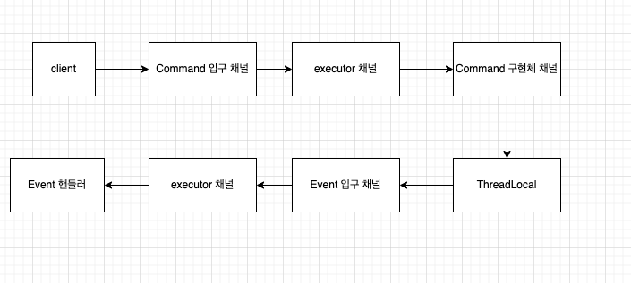

# Spring integration 메시징 플로우

### 개요
- 주로 DSL로만 작성해보자
- 대략적인 메시지 처리 flow
  - user -> controller -> command channel -> command handler -> event channel -> event handler
    

### 고민
- Command 전송용 Template 사용 vs @MessagingGateway
  - @MessagingGateway가 나은듯

